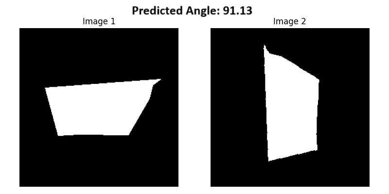

# 🔄 GeoAngleNet

A deep learning project for estimating **relative rotation angles** between two shape images using **autoencoder-based corner detection** and **polar coordinate regression**.

This project combines synthetic data generation, autoencoder-based feature extraction, and a regression model that learns to predict rotation angles using the sine of polar angular features.




---

## 📂 Project Structure

```
TWO-SHAPE-ORIENTATION/
│
├── inference/
│   ├── classes.py               # Utility classes for loading models, processing data
│   └── inference_code.py        # Inference pipeline: input → corner detection → angle prediction
│
├── synthetic_dataset_complex/
│   └── sample_000X/             # Synthetic shapes and masks with ground truth angle
│
├── trained_models/
│   ├── autoencoder_checkpoint.pth     # Trained corner detection model
│   └── regressor_checkpoint.pth       # Trained angle regressor model
│
├── auto_encoder_training.ipynb        # Train autoencoder to detect shape corners
├── complete_model_train.ipynb         # Full pipeline training: polar angle regression
├── generate_synthetic_data.py         # Generates rotated synthetic shape datasets
├── .gitignore
└── README.md
```

---

## 🎯 Objective

Estimate the **rotation angle** between two versions of a cornered shape that has been rotated with noise. The angle prediction is done by:

1. Detecting shape corners using an autoencoder.
2. Converting corners into **polar coordinates** (relative to shape centroid).
3. Using the **sine of polar angles** as features.
4. Predicting the **sine of the relative rotation angle** using an MLP regressor.
5. Converting predicted `sin(θ)` back into degrees.

---

## 🔁 Pipeline Overview

### 1. Synthetic Shape Dataset Generation
- Shapes are generated with random positions and 4 corners.
- Each shape is randomly rotated and stored as:
  - Input shape image
  - Corner mask
  - Ground truth rotation angle

### 2. Autoencoder-Based Corner Detection
- An autoencoder learns to reconstruct corner masks from shape inputs.
- The encoder captures latent shape features and outputs a **corner probability mask**.

### 3. Polar Coordinate Conversion
- Detected corner coordinates are converted into polar form `(r, θ)` relative to the shape's centroid.
- Only **θ** is used, and represented as **`sin(θ)`** to maintain smoothness across angle boundaries.

### 4. Angle Regression via Polar Feature Comparison
- Corner features from two shapes are compared.
- An **MLP (Multi-Layer Perceptron)** learns to regress the sine of the relative rotation angle.
- The prediction is `sin(Δθ)` → `arcsin()` → final angle in degrees.

---

## 📊 Why Angle Estimation is Hard

- **360° Wraparound**: Regression near 0°/360° is unstable without trig-based encoding.
- **Shape Symmetry**: Many shapes (like squares) look similar at multiple orientations.
- **Noise & Perturbation**: Slight changes in detected corners can throw off angle estimation.
- **Loss Discontinuity**: Angle loss without using sine/cosine representation suffers from large jumps around boundary angles.

---

## 🧪 How to Run

### 1. Generate Data
```bash
python generate_synthetic_data.py
```

### 2. Train Autoencoder
Open and run:
```bash
auto_encoder_training.ipynb
```

### 3. Train Angle Regressor
Open and run:
```bash
complete_model_train.ipynb
```

### 4. Run Inference
```bash
cd inference
python inference_code.py
```

---

## 🧠 Model Architecture

### Autoencoder
- Encoder: Conv → ReLU → Downsample
- Decoder: Upsample → Conv → Sigmoid
- Output: Corner mask prediction

### Regressor (MLP)
- Input: Polar sine features from two shapes
- Architecture: Dense → ReLU → Dense → Output (`sin(angle)`)
- Output: Predicted `sin(Δθ)` → Converted to degrees


## 📌 Future Improvements

- Use both `sin(θ)` and `cos(θ)` to predict full circular angle.
- Add real-world shape detection.
- Improve corner detection using attention-based models.

---

## 📸 Example Output

```
Input A          Input B
[shape.png]  →   [rotated_shape.png]
                ↓
        Predicted Δθ ≈ 46.7° (Ground Truth: 45°)
```

---

## 👤 Author

Developed by BimsaraS99

MPhil(R) + Python Developer 
2025

---
